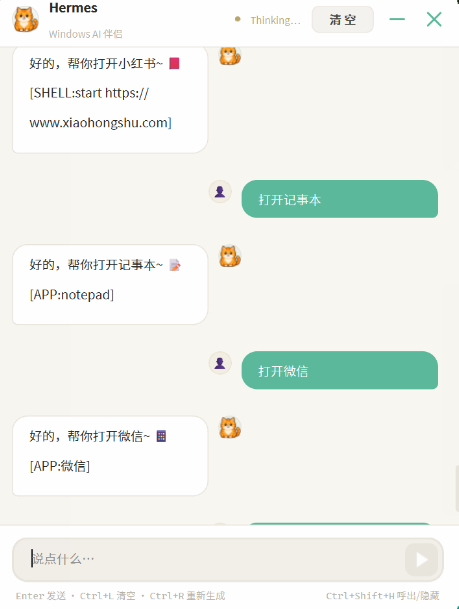
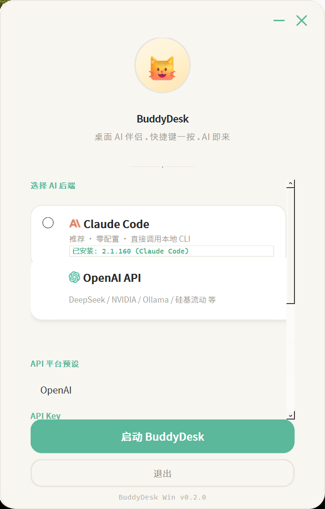

<p align="center">
  
</p>

<h1 align="center">BuddyDesk</h1>

<p align="center">
  <strong>你的桌面 AI 伴侣</strong><br>
  快捷键一按，AI 即来；说完就走，不打扰工作。
</p>

<p align="center">
  
  
  
</p>

---

## 这是什么？

BuddyDesk 是一个住在你桌面上的 AI 助手。

它不是浏览器里的聊天框，也不是任务栏里的图标——它是一只**像素橘猫**，安静地待在你的桌面上。按 `Ctrl+Shift+H`，AI 灵动岛出现；对它说话，它帮你做事。

说"打开微信"，微信就打开。说"查看 IP"，结果直接给你。说"帮我写个贪吃蛇"，它调用 Claude Code 真的写一个出来。

<p align="center">
  
</p>

---

## 它能做什么？

### 快捷键一按，AI 即来

不用打开浏览器，不用切换窗口。按一个快捷键，聊天窗口瞬间出现。说完就走，不打扰你的工作流。

<p align="center">
  
</p>

### 说人话，它就懂

不需要学习命令行，不需要写代码。用自然语言告诉它你想做什么，它来执行。

<p align="center">
  
</p>

- **"打开微信"** → 直接启动微信
- **"打开记事本"** → 启动记事本
- **"查看 IP 地址"** → 执行 ipconfig 并给你结果
- **"帮我写一个贪吃蛇"** → 调用 Claude Code 生成代码

### 像素橘猫，陪你工作

一只 128px 的像素猫住在你的桌面上。它会走来走去、会打瞌睡、会开心地跳。你可以拖拽它，双击它打开聊天。

<p align="center">
  
  &nbsp;&nbsp;&nbsp;
  
</p>

### AI 不只是聊天，它能动手

| 你说 | 它做 |
|------|------|
| "打开微信" | 启动微信 |
| "查看 IP 地址" | 执行 `ipconfig`，告诉你结果 |
| "帮我写贪吃蛇" | 调用 Claude Code 生成 `snake_game.py` |
| "今天天气怎么样" | 查询天气并回答 |

---

## 安装（30 秒）

**第一步：下载**

```bash
git clone https://github.com/lzsobig/BuddyDesk-pet-claude.git
cd BuddyDesk-pet-claude
```

**第二步：双击启动**

- 双击 `启动 BuddyDesk.bat` → 自动检测 Python、安装依赖、启动
- 或双击 `启动 BuddyDesk.vbs` → 同上，无黑色命令行窗口

**第三步：选择 AI 后端**

| 后端 | 说明 | 配置难度 |
|------|------|----------|
| **Claude Code** | 已安装 Claude Code CLI 的话，零配置直接用 | ⭐ 最简单 |
| **DeepSeek** | 填一个 API Key | ⭐⭐ |
| **OpenAI / Ollama** | 其他平台都支持 | ⭐⭐ |

---

## 快捷键

| 操作 | 效果 |
|------|------|
| `Ctrl+Shift+H` | 呼出 / 隐藏 AI |
| `Ctrl+F` | 切换聊天窗口 |
| 点击灵动岛 | 打开聊天 |
| 双击像素猫 | 打开聊天 |
| 拖拽像素猫 | 移动位置 |

---

## 系统要求

- Windows 10 / 11
- Python 3.10 以上（启动脚本会自动安装，你不需要手动装）

---

## 常见问题

**Q：它会偷偷执行危险命令吗？**
不会。三级安全机制：打开应用直接执行，系统命令展示结果，危险操作必须你确认。

**Q：我需要会编程吗？**
完全不需要。BuddyDesk 就是给普通用户用的。

**Q：数据会上传吗？**
AI 后端由你选择。Claude Code 走 Anthropic API，OpenAI 模式走你自己的 API Key，本地 Ollama 完全离线。

---

<p align="center">
  
  <br><br>
  <b>Made with Python and love for pixel cats</b><br>
  <sub>Inspired by <a href="https://github.com/nicepkg/HermesPet">HermesPet</a> for macOS</sub>
</p>
