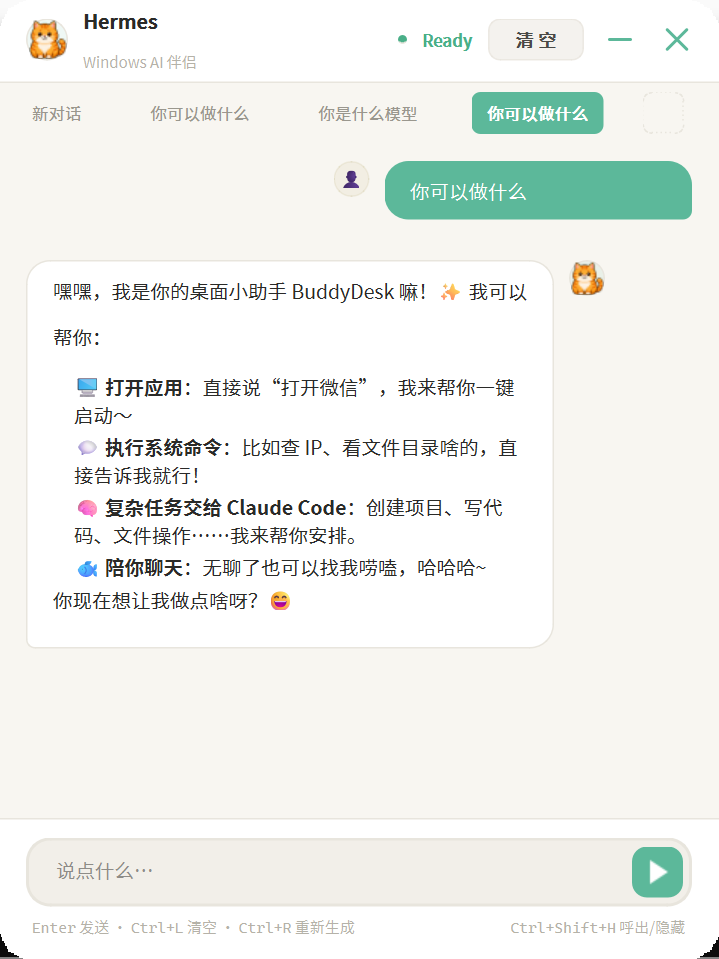
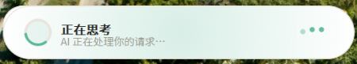
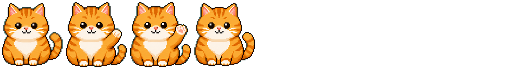

<p align="center">
  
</p>

<h1 align="center">BuddyDesk</h1>

<p align="center">
  <strong>Windows 桌面 AI 伴侣</strong><br>
  灵动岛 · 像素橘猫 · 自然语言命令执行 · Claude Code 集成
</p>

<p align="center">
  
  
  
  
</p>

<p align="center">
  快捷键一按，AI 即来。<br>
  说"打开微信"就能打开，说"查看IP"就能执行。<br>
  纯 Python，零 Electron，零 Node.js。
</p>

<p align="center">
  <a href="#quick-start">Quick Start</a> · <a href="#features">Features</a> · <a href="#architecture">Architecture</a> · <a href="#roadmap">Roadmap</a>
</p>

---

## Why BuddyDesk

> AI 工具界有个不成文的规则：越专业，界面越严肃。
> 但当你面对一只像素橘猫的时候，你不会觉得"这个问题太蠢了不好意思问"。

BuddyDesk 不是另一个聊天框。它住在你的桌面上 —— 顶部有灵动岛，角落有像素猫，快捷键一按就来，说完就走。

---

## Features 特性

<h3>🏝️ Dynamic Island 灵动岛</h3>

屏幕顶部的浮动胶囊，5 种状态实时反馈：

`idle` · `thinking` · `result` · `notify` · `error`

All-Paint 架构 — 所有动画在 `paintEvent` 中绘制，零子控件，`QPainterPath` 抗锯齿。悬停展开预览，点击打开聊天。

<h3>🐱 Pixel Pet 像素宠物</h3>

一只 128px 像素橘猫陪你工作。7 种状态，72 帧精灵图：

| State | Description |
|-------|-------------|
| `idle` | 静静待着 |
| `walk` | 桌面闲逛，自动转向 |
| `happy` | 开心跳动 |
| `sleep` | 打瞌睡，ZZZ 飘浮 |
| `love` | 冒爱心 |
| `thinking` | 跟着 AI 一起思考 |
| `error` | 出错时心疼你 |

拖拽移动，双击打开聊天。

<h3>⚡ Command Execution 命令执行</h3>

AI 不只是聊天，**能直接操作你的电脑**：

```
你: 打开微信
AI: 好的，帮你打开微信~ [APP:微信]
   已打开: 微信

你: 查看 IP 地址
AI: 正在查询... [SHELL:ipconfig]
   IPv4: 192.168.1.xxx

你: 帮我写一个贪吃蛇
AI: 让 Claude Code 来帮你！ [CLAUDE:创建贪吃蛇游戏]
   snake_game.py 已创建
```

引擎自动解析回复中的标签并执行：`[APP:xxx]` 启动应用、`[SHELL:xxx]` 执行命令、`[CLAUDE:xxx]` 调用 Claude Code。

<h3>💬 Multi-Conversation 多对话</h3>

多对话标签栏 — 新建、切换、关闭。自动从首条消息生成标题，关闭时保存，启动时恢复。

<h3>🤖 Claude Code Integration</h3>

本地安装了 Claude Code CLI？**零配置，打开就用。** 编程、重构、项目创建，一句话搞定。

<h3>🔌 Multi-Backend 多后端</h3>

DeepSeek / NVIDIA / 硅基流动 / Moonshot / Ollama 一键预设。填一个 API Key，选个模型，开聊。

---

## Screenshots

<p align="center">
  
  &nbsp;&nbsp;
  
  &nbsp;&nbsp;
  
</p>

<p align="center">
  <em>启动配置 · 灵动岛思考中 · 聊天界面</em>
</p>

---

## Quick Start

<details open>
<summary><b>One-Click Launch</b> (recommended)</summary>

<br>

双击 `启动 BuddyDesk.bat` — 自动检测 Python、安装依赖、启动应用。

静默版（无命令行窗口）：双击 `启动 BuddyDesk.vbs`

</details>

<details>
<summary><b>Manual Setup</b></summary>

```bash
git clone https://github.com/lzsobig/BuddyDesk-pet-claude.git
cd BuddyDesk-pet-claude
pip install -r requirements.txt
python main.py
```

</details>

<details>
<summary><b>AI Backend</b></summary>

**Claude Code** — Install [Claude Code CLI](https://docs.anthropic.com/en/docs/claude-code), select "Claude Code" on launch. Done.

**OpenAI API** — Paste API key, choose a platform:

| Platform | Base URL |
|----------|----------|
| OpenAI | `https://api.openai.com/v1` |
| DeepSeek | `https://api.deepseek.com/v1` |
| NVIDIA | `https://integrate.api.nvidia.com/v1` |
| SiliconFlow | `https://api.siliconflow.cn/v1` |
| Moonshot | `https://api.moonshot.cn/v1` |
| Ollama | `http://localhost:11434/v1` |

</details>

---

## Controls

| Action | Effect |
|--------|--------|
| `Ctrl+Shift+H` | Toggle chat window |
| Click island | Open chat |
| Double-click pet | Open chat |
| Drag pet | Move position |
| Hover island | Preview state |
| "打开XXX" | Launch app |
| "查看XXX" | Run command |
| "帮我XXX" | Claude Code task |

---

## Architecture

```
┌─────────────┐     ┌──────────────┐     ┌───────────────┐
│  User Input │────▶│  ChatWindow  │────▶│   AIBridge    │
└─────────────┘     └──────────────┘     └───────┬───────┘
                                                  │
                    ┌──────────────┐              │ Thread
                    │ CommandEngine│◀─────────────┤
                    └──────┬───────┘              │
                           │                      ▼
                    ┌──────▼───────┐     ┌───────────────┐
                    │  [APP:xxx]   │     │  AI Backend   │
                    │  [SHELL:xxx] │     │  Claude/OpenAI│
                    │  [CLAUDE:xxx]│     └───────────────┘
                    └──────────────┘
```

| Component | Technology |
|-----------|------------|
| UI Framework | PySide6 (Qt for Python) |
| Dynamic Island | QPainter All-Paint |
| Pet Animation | 72-frame sprite sheet |
| AI Backend | Claude Code CLI / OpenAI API |
| Hotkey | ctypes GetAsyncKeyState |
| Config | JSON (`~/.buddydesk/`) |
| Testing | pytest |

---

## Roadmap

| Status | Feature | Description |
|--------|---------|-------------|
| ✅ | Dynamic Island | 5-state floating capsule |
| ✅ | Pixel Pet | 72-frame animated cat |
| ✅ | Command Execution | Natural language → system action |
| ✅ | Dual Backend | Claude Code + OpenAI API |
| ✅ | Multi-Conversation | Tab bar + persistence |
| ✅ | One-Click Launcher | .bat + .vbs |
| 🔜 | Plugin System | Community skins & commands |
| 🔜 | Voice Interaction | Talk to your pet |
| 🔜 | Pet Learning | Proactive reminders |
| 🔜 | Cross-Platform | macOS / Linux |

---

<p align="center">
  
  <br><br>
  <b>Made with Python and love for pixel cats</b><br>
  <sub>Inspired by <a href="https://github.com/nicepkg/HermesPet">HermesPet</a> for macOS</sub>
</p>
