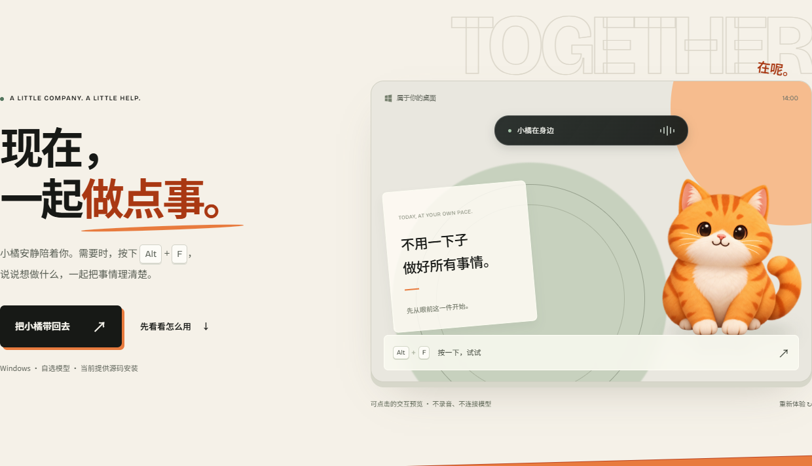
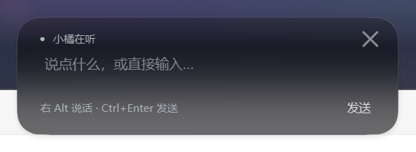
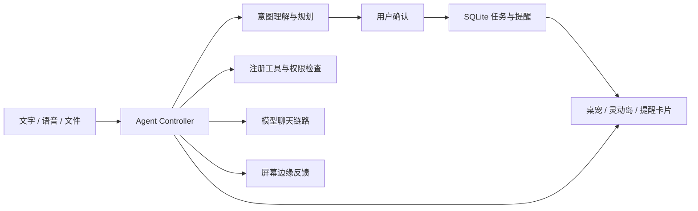

<p align="center">
  
</p>
<h1 align="center">BuddyDesk</h1>
<p align="center">
  <strong>你的桌面，多一个搭子。</strong><br>
  平时安静陪着你，需要时一起把事情做好。
</p>
<p align="center">
  <a href="https://lzsobig.github.io/BuddyDesk-pet-claude/">体验产品页</a> ·
  <a href="#quick-start">安装与配置</a> ·
  <a href="https://github.com/lzsobig/BuddyDesk-pet-claude/archive/refs/heads/main.zip">下载源码</a> ·
  <a href="https://github.com/lzsobig/BuddyDesk-pet-claude/issues">反馈问题</a>
</p>
<p align="center"><sub>Windows · Python / PySide6 + Rust / WinIsland · v0.3.0 · 当前以源码安装</sub></p>

<a href="https://lzsobig.github.io/BuddyDesk-pet-claude/">
  
</a>
<p align="center"><sub>点开产品页，可以体验一段使用示例：说说今天的事、修改清单、确认，以及完成和撤销。</sub></p>

## 从“我今天要做什么”，到“已经安排好了”

BuddyDesk 是一个正在成长的 Windows 桌面 Personal Agent。桌宠是它的角色，灵动岛是它的轻量入口，聊天窗口是更详细的协作空间。

按下 **Alt+F**，可以问问题、聊想法、整理今天的事，或修改已有清单。小橘先理解你的意思，涉及任务变更时交给你核对；确认以后，事项才写入本地数据库、显示到灵动岛，并安排提醒。

| 你想做什么         | 小橘现在怎样帮你                                              |
| ------------------ | ------------------------------------------------------------- |
| 整理今天的事       | 提取事项、时间与提醒，给出可编辑的确认清单                    |
| 修改已有清单       | 理解修改、删除、完成或撤销完成的意图；不把每句话都当成新任务  |
| 看一眼接下来做什么 | 今日事项附在原生灵动岛展开内容下方，保留原来的媒体和桌宠区域  |
| 做完一件事         | 点击事项前的小圆圈完成；再点一次撤销。删除由你明确决定        |
| 到点提醒           | 本地持久化提醒，联动桌宠、灵动岛和提醒卡片，可完成或延后      |
| 把文件交给助手     | 临时阅读、总结、提取任务、提问，或明确加入个人资料库          |
| 调用本机工具       | 默认逐次确认；可主动选择完全访问，权限受当前 Windows 账户限制 |

## 桌面上的反馈，放在合适的位置

- **桌宠**：待机、思考、抚摸与拖动等动作，让状态看得见。
- **原生灵动岛**：沿用 WinIsland 的毛玻璃、连续圆角和展开动画；语音输入直接贴在岛面。
- **屏幕边缘**：聆听、转写、理解等阶段给出光效反馈，支持关闭动态效果。
- **聊天窗口**：显示实际处理阶段、文件入口与可展开的工具结果，不让用户面对一个一直转的等待状态。

<p align="center">
  
  <br><sub>Windows 实机输入界面。产品页里的任务演示使用示例内容，不会录音或调用模型。</sub>
</p>

## Quick Start

### 1. 下载源码，运行基础桌宠

需要 Windows 和 64 位 Python。本机已验证 Python 3.12；下载源码后，在根目录运行：

```powershell
python -m venv .venv
.\.venv\Scripts\python.exe -m pip install -r requirements.txt
.\.venv\Scripts\python.exe main.py
```

这样不需要修改 PowerShell 的脚本执行策略。也可以双击根目录的 **启动 BuddyDesk.bat**，由脚本定位 Python 并安装依赖；安装成功后，**启动 BuddyDesk.vbs** 可静默启动。

基础模式使用 Qt 灵动岛。想使用产品页展示的原生毛玻璃、岛内输入和今日事项，请继续下一步。

### 2. 启用原生 WinIsland

准备 **Rust MSVC 工具链、Visual Studio C++ Build Tools 和 LLVM**，在源码根目录编译：

```powershell
cargo build --release --manifest-path winisland/Cargo.toml
```

在两个终端中分别运行，先启动助手，再启动灵动岛：

```powershell
# 终端 1：助手
.\.venv\Scripts\python.exe main.py --winisland --background
```

```powershell
# 终端 2：原生灵动岛
.\winisland\target\release\WinIsland.exe --companion
```

若自行设置了 `CARGO_TARGET_DIR`，请从对应输出目录启动 `WinIsland.exe`。

### 3. 配置自己的模型

从托盘、宠物菜单或聊天窗口进入 **设置 → 连接**。

| 接入方式        | 需要配置                                 |
| --------------- | ---------------------------------------- |
| OpenAI 兼容服务 | API 基础地址、API Key、模型名称          |
| 本机模型服务    | 本机服务地址与模型名称；需先部署相应服务 |
| Claude Code CLI | 另行安装并配置 CLI，必要时填写其路径     |

连接支持已配置的 OpenAI 兼容服务，包括 DeepSeek、硅基流动等；选择哪一个取决于你自己的服务账户。保存后会更新连接。**语音识别的 Key 与聊天模型的 Key 分开配置。**

### 4. 选择语音方式

打开 **设置 → 语音**，先点“试说一句”验证转写，再保存。

| 方式            | 如何使用                                                  | 要注意什么                                                                          |
| --------------- | --------------------------------------------------------- | ----------------------------------------------------------------------------------- |
| 本地 SenseVoice | 一键安装，或选择已有的 SenseVoice-Small ONNX 模型目录     | 目录须含 `model.onnx` 和 `tokens.json`；模型不随源码分发                            |
| 云端语音 API    | 填写 API 基础地址、语音 Key 和识别模型                    | 服务需兼容 `POST /audio/transcriptions`；录音会发送至该服务                         |
| 本机兼容 API    | 在 API 模式填写本机语音服务的基础地址与模型               | localhost 可不填 Key；Whisper、Qwen 等服务须提供兼容 API，Web UI 地址本身不等于 API |
| 豆包输入法兼容  | 本机先安装并启用豆包，Alt+F 打开接收区，再按住右 Alt 说话 | 保留的两步兼容方式；直接录音请选本地或 API 模式                                     |

本地识别可以离线运行；大模型是否离线取决于你使用本机还是云端模型。云端语音服务可能收费，需要使用自己的服务账户。

## 日常使用

| 操作               | 作用                                         |
| ------------------ | -------------------------------------------- |
| **Alt+F**          | 开始协作输入；直接录音模式下再次按下结束录音 |
| **Esc**            | 取消当前聆听或正在处理的语音交互             |
| **Ctrl+Enter**     | 在灵动岛文字接收区发送                       |
| **Ctrl+Shift+H**   | 显示或隐藏聊天窗口                           |
| 双击桌宠           | 打开聊天                                     |
| 拖动桌宠           | 调整它的位置                                 |
| 点击事项前的小圆圈 | 完成 / 撤销完成                              |
| 拖入文件或文件夹   | 先选择处理方式，不默认永久保存               |

例如：

> “下午两点有结构力学课，晚上八点提醒我给老师发材料。”
>
> “数学第三章已经做好了，把它标记完成。”
>
> “这个文件夹里面有什么？先别读子文件。”

任务变更先核对。语音识别不准确时，可以修正文案和时间；不要重复确认已经保存成功的同一份清单。

## 文件、资料与权限

**文件入口**支持文本 PDF、DOCX、XLSX、Markdown、TXT、代码和常见图片。图片文字识别依赖 Windows OCR 语言包；扫描 PDF 请先进行 OCR。旧版 DOC / XLS 需要另存为新格式。

- **临时阅读**：作为当前会话的参考，不默认加入资料库。
- **加入知识库**：只有明确选择此项，才持久保存资料。
- **文件夹**：先列直接子项，不自动递归读取整个目录。
- **容量**：一次最多 5 个文件或文件夹，单文件最多 20 MB；过大的文档需先拆分。

**访问权限**在“设置 → 偏好”选择。默认逐次确认；完全访问需要你主动开启，不等于管理员权限。任务清单变更仍保留确认，涉及外部文件参考内容的操作也继续核对。

配置、聊天、任务、提醒和个人资料保存在当前用户的 **`.buddydesk`** 目录。使用云端模型或语音服务时，相关输入会发送给你配置的服务；不要把该目录当作源码一起分享。

## 当前状态

当前重点是桌面交互、语音入口、任务与提醒，以及文件处理。源码可运行；跨电脑安装、不同麦克风与语音服务的稳定性还需要在各自环境中验证。更深入的自动长期记忆和工具能力仍在完善。

**目前不提供已验证的 EXE 发布包。** `build.spec` 保留开发中的打包流程，不能把生成调试包等同于已经完成发布验证。

## Architecture

保持现有技术栈增量开发，没有把项目换成新的桌面框架。


```mermaid
flowchart LR
    Input[文字 / 语音 / 文件] --> Agent[Agent Controller]
    Agent --> Planner[意图理解与规划]
    Planner --> Confirm[用户确认]
    Confirm --> Store[SQLite 任务与提醒]
    Agent --> Tools[注册工具与权限检查]
    Agent --> Chat[模型聊天链路]
    Store --> UI[桌宠 / 灵动岛 / 提醒卡片]
    Agent --> UI
    Agent --> Overlay[屏幕边缘反馈]
```

| 模块                         | 实现                                                       |
| ---------------------------- | ---------------------------------------------------------- |
| 桌宠、聊天、设置与语音输入区 | Python + PySide6                                           |
| 原生灵动岛                   | Rust + Skia / Windows Composition，位于 `winisland/`       |
| 统一 Agent 状态与交互        | `agent_controller.py`、`agent_state.py`                    |
| 任务、提醒与排序             | `agent_tasks.py`、`task_planner.py`                        |
| 本地语音与 API 识别          | `agent_voice.py`、`sensevoice_asr.py`、`voice_services.py` |
| 模型通信                     | `bridge.py`、`ai/backend.py`                               |
| 文件解析与个人资料           | `personal_context.py`                                      |
| 工具与权限                   | `agent_tools.py`、`engine/command_engine.py`               |
| 前后端联动                   | Qt Signals / Slots；原生灵动岛通过本机 JSON 文件通信       |

## 反馈与参与

欢迎通过 [Issues](https://github.com/lzsobig/BuddyDesk-pet-claude/issues) 反馈。请附 Windows / Python 版本、使用的接入方式和复现步骤；API Key、个人文件和完整聊天记录请先移除。

BuddyDesk 部分采用 [MIT 许可证](LICENSE)。原生 WinIsland 部分保留其独立的 [GPL-3.0 许可证](winisland/LICENSE)。

<p align="center"><b>小橘在身边。一起，把今天做好。</b><br><sub><a href="https://lzsobig.github.io/BuddyDesk-pet-claude/">看看产品页</a> · <a href="https://github.com/lzsobig/BuddyDesk-pet-claude/archive/refs/heads/main.zip">带小橘回家</a></sub></p>
